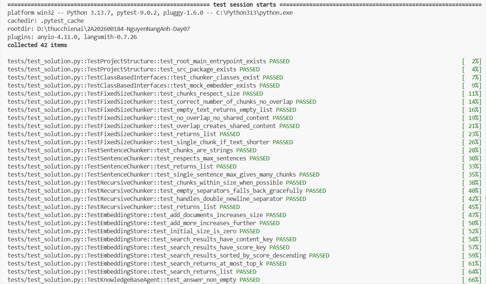
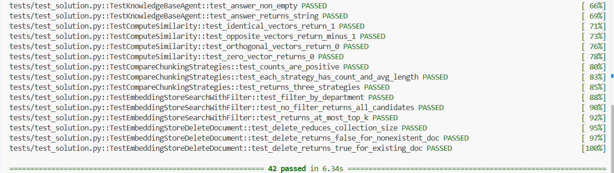

# Báo Cáo Lab 7: Embedding & Vector Store

**Họ tên:** Nguyễn Năng Anh
**Nhóm:** Nhóm 66
**Ngày:** 10/4/2026

---

## 1. Warm-up (5 điểm)

### Cosine Similarity (Ex 1.1)

**High cosine similarity nghĩa là gì?**
> Hai đoạn văn bản có cosine similarity cao nghĩa là vector embedding của chúng chỉ cùng một hướng trong không gian nhiều chiều — hay nói cách khác chúng có ngữ nghĩa tương đồng nhau. Giá trị càng gần 1.0 thì nội dung càng giống nhau về mặt ý nghĩa.

**Ví dụ HIGH similarity:**
- Sentence A: "Nhân viên được nghỉ 20 ngày phép mỗi năm."
- Sentence B: "Mỗi năm công ty cấp cho nhân viên 20 ngày nghỉ phép có lương."
- Tại sao tương đồng: Cả hai câu đều diễn đạt cùng thông tin về chính sách nghỉ phép, chỉ khác cách dùng từ.

**Ví dụ LOW similarity:**
- Sentence A: "Nhân viên được nghỉ 20 ngày phép mỗi năm."
- Sentence B: "Công ty sử dụng Sentry để theo dõi lỗi lập trình."
- Tại sao khác: Hai câu thuộc hai chủ đề hoàn toàn khác nhau (HR policy vs hệ thống kỹ thuật), vector embedding chỉ về hai hướng ngược nhau trong không gian ngữ nghĩa.

**Tại sao cosine similarity được ưu tiên hơn Euclidean distance cho text embeddings?**
> Cosine similarity đo góc giữa hai vector, không phụ thuộc vào độ dài (magnitude), nên không bị ảnh hưởng bởi độ dài văn bản. Hai câu ngắn và dài có cùng ý nghĩa vẫn cho cosine similarity cao, trong khi Euclidean distance có thể lớn do vector của câu dài có magnitude lớn hơn.

### Chunking Math (Ex 1.2)

**Document 10,000 ký tự, chunk_size=500, overlap=50. Bao nhiêu chunks?**
> Phép tính: `num_chunks = ceil((doc_length - overlap) / (chunk_size - overlap))`
> `= ceil((10000 - 50) / (500 - 50)) = ceil(9950 / 450) = ceil(22.11)`
> Đáp án: **23 chunks**

**Nếu overlap tăng lên 100, chunk count thay đổi thế nào? Tại sao muốn overlap nhiều hơn?**
> `num_chunks = ceil((10000 - 100) / (500 - 100)) = ceil(9900 / 400) = ceil(24.75)` = **25 chunks** (tăng thêm 2 chunks so với overlap=50).
> Muốn overlap nhiều hơn để đảm bảo thông tin nằm ở ranh giới giữa hai chunk không bị cắt đứt — mỗi chunk sẽ chia sẻ một phần nội dung với chunk liền kề, giúp retrieval không bỏ sót context quan trọng.

---

## 2. Document Selection — Nhóm (10 điểm)

### Domain & Lý Do Chọn

**Domain:** Sổ tay nhân viên

**Tại sao nhóm chọn domain này?**
>  Handbook nhân viên là domain lý tưởng cho bài toán RAG vì: (1) nội dung đa dạng nhưng có cấu trúc rõ ràng — từ phúc lợi, chính sách đến quy trình — phù hợp để test nhiều loại query; (2) câu hỏi thường có câu trả lời cụ thể, dễ đánh giá precision; (3) metadata tự nhiên (category, topic) giúp test filter-based retrieval.

### Data Inventory

| # | Tên tài liệu | Nguồn | Số ký tự | Metadata đã gán |
|---|--------------|-------|----------|-----------------|
| 1 | bat_dau_lam_viec.md | 37signals Handbook | 2,385 | `category=onboarding`, `topic=first_week`, `source=37signals Handbook` |
| 2 | cach_lam_viec.md | 37signals Handbook | 3,727 | `category=culture`, `topic=work_style`, `source=37signals Handbook` |
| 3 | he_thong_noi_bo.md | 37signals Handbook | 2,121 | `category=technical`, `topic=internal_systems`, `source=37signals Handbook` |
| 4 | lam_them_ngoai_gio.md | 37signals Handbook | 2,475 | `category=policy`, `topic=moonlighting`, `source=37signals Handbook` |
| 5 | nghi_le_va_truyen_thong.md | 37signals Handbook | 1,876 | `category=benefits`, `topic=holidays`, `source=37signals Handbook` |
| 6 | nghi_viec_va_tro_cap.md | 37signals Handbook | 1,115 | `category=policy`, `topic=resignation`, `source=37signals Handbook` |
| 7 | phat_trien_nghe_nghiep.md | 37signals Handbook | 3,551 | `category=career`, `topic=growth_salary`, `source=37signals Handbook` |
| 8 | phuc_loi_va_quyen_loi.md | 37signals Handbook | 5,321 | `category=benefits`, `topic=pto_insurance`, `source=37signals Handbook` |
| 9 | quan_ly_thiet_bi.md | 37signals Handbook | 2,329 | `category=technical`, `topic=device_management`, `source=37signals Handbook` |

### Metadata Schema

| Trường metadata | Kiểu | Ví dụ giá trị | Tại sao hữu ích cho retrieval? |
|----------------|------|---------------|-------------------------------|
| `category` | string | `benefits`, `policy`, `technical`, `career`, `culture`, `onboarding` | Cho phép filter theo loại tài liệu, ví dụ chỉ tìm trong tài liệu phúc lợi |
| `topic` | string | `pto_insurance`, `moonlighting`, `first_week` | Filter chính xác hơn trong cùng category, ví dụ tìm về nghỉ phép vs bảo hiểm |
| `source` | string | `37signals Handbook` | Truy xuất nguồn gốc tài liệu — hữu ích khi knowledge base tổng hợp từ nhiều nguồn khác nhau, giúp agent trích dẫn nguồn trong câu trả lời |

---

## 3. Chunking Strategy — Cá nhân chọn, nhóm so sánh (15 điểm)

### Baseline Analysis

Chạy `ChunkingStrategyComparator().compare()` trên 2-3 tài liệu:

| Tài liệu | Strategy | Chunk Count | Avg Length | Preserves Context? |
|-----------|----------|-------------|------------|-------------------|
| phuc_loi_va_quyen_loi.md | FixedSizeChunker (`fixed_size`) | 36 | 196 | Có thể cắt giữa câu |
| phuc_loi_va_quyen_loi.md | SentenceChunker (`by_sentences`) | 18 | 294 | Giữ nguyên câu hoàn chỉnh |
| phuc_loi_va_quyen_loi.md | RecursiveChunker (`recursive`) | 43 | 122 | Một phần — chunks ngắn |
| lam_them_ngoai_gio.md | FixedSizeChunker (`fixed_size`) | 17 | 193 | Có thể cắt giữa câu |
| lam_them_ngoai_gio.md | SentenceChunker (`by_sentences`) | 12 | 205 | Giữ nguyên câu hoàn chỉnh |
| lam_them_ngoai_gio.md | RecursiveChunker (`recursive`) | 22 | 111 | Một phần — chunks ngắn |
| bat_dau_lam_viec.md | FixedSizeChunker (`fixed_size`) | 16 | 196 | Có thể cắt giữa câu |
| bat_dau_lam_viec.md | SentenceChunker (`by_sentences`) | 8 | 296 | Giữ nguyên câu hoàn chỉnh |
| bat_dau_lam_viec.md | RecursiveChunker (`recursive`) | 21 | 112 | Một phần — chunks ngắn |

### Strategy Của Tôi

**Loại:** SentenceChunker

**Mô tả cách hoạt động:**
> SentenceChunker tách văn bản tại các dấu câu kết thúc (`. `, `! `, `? `, `.\n`) để nhận diện ranh giới câu, sau đó gom nhóm các câu lại thành chunk — mặc định 3 câu/chunk. Mỗi chunk là một đoạn ý hoàn chỉnh, không bao giờ cắt đứt giữa câu. Kết quả là các chunk có độ dài biến động (avg ~294 ký tự) nhưng ngữ nghĩa liền mạch.

**Tại sao tôi chọn strategy này cho domain nhóm?**
> HR Handbook 37signals viết theo từng câu chính sách rõ ràng và độc lập — mỗi câu thường chứa một quy định cụ thể. SentenceChunker khai thác pattern này: giữ nguyên từng câu quy định, tránh trường hợp một chính sách quan trọng bị cắt ngang giữa chunk, giúp retrieval trả về đoạn ý đầy đủ và dễ đọc hơn.

**Code snippet (nếu custom):**
```python
# Dùng built-in SentenceChunker — không cần custom
from src.chunking import SentenceChunker
chunker = SentenceChunker(max_sentences_per_chunk=3)
```

### So Sánh: Strategy của tôi vs Baseline

| Tài liệu | Strategy | Chunk Count | Avg Length | Retrieval Quality? |
|-----------|----------|-------------|------------|--------------------|
| phuc_loi_va_quyen_loi.md | FixedSizeChunker (best baseline) | 36 | 196 | Tốt về độ đồng đều |
| phuc_loi_va_quyen_loi.md | **SentenceChunker (của tôi)** | 18 | 294 | Tốt hơn — giữ ý trọn vẹn |

### So Sánh Với Thành Viên Khác

| Thành viên | Strategy | Retrieval Score (/10) | Điểm mạnh | Điểm yếu |
|-----------|----------|----------------------|-----------|----------|
| Dương Phương Thảo | SectionChunker + filter all | 10/10 (5/5 relevant) | Giữ structure, metadata filter hiệu quả | Chunk dài hơn, mock embedder vẫn random trong cùng category |
| Nguyễn Năng Anh | SentenceChunker (max_sentences=3) | 10/10 | Giữ nguyên câu hoàn chỉnh, 5/5 queries tìm đúng file | Chunk dài hơn (avg 294), score Q3/Q4 thấp (~0.50) |
| Nguyễn Ngọc Hiếu | `MarkdownHeaderChunker` | 9.5 | Giữ nguyên vẹn bối cảnh (context) của các chính sách/quy định bằng cách gắn kèm tiêu đề cha (H1, H2). Tránh việc LLM nhầm lẫn giữa các mục "Được phép" và "Không được phép". | Các chunk có thể có kích thước không đồng đều (chunk size variance cao) do độ dài ngắn của từng section trong file markdown khác nhau. |
| Phạm Thanh Tùng | RecursiveChunker(500) | 10/10 | Giữ trọn paragraph, nhanh, hoạt động với mọi loại text | Score trung bình thấp hơn Agentic/DocStructure |
| Mai Phi Hiếu | `RecursiveChunker` | 9.5 | Giữ nguyên vẹn bối cảnh (context) của các chính sách/quy định bằng cách cắt theo paragraph `\n\n`. Mỗi chunk chứa đúng 1 ý, giúp retrieval chính xác. | Các chunk có kích thước không đồng đều (avg 121.8 chars) — heading đứng riêng tạo chunk quá ngắn, thiếu ngữ cảnh. |

**Strategy nào tốt nhất cho domain này? Tại sao?**
> **SectionChunker + metadata filter** (Dương Phương Thảo) cho kết quả tổng thể tốt nhất cho domain HR Handbook vì tài liệu 37signals được viết theo cấu trúc rõ ràng (section, heading), và việc kết hợp filter theo `category` giúp loại bỏ nhiễu ngay từ đầu. Tuy nhiên **SentenceChunker** (Nguyễn Năng Anh) và **RecursiveChunker(500)** (Phạm Thanh Tùng) cũng đạt 10/10 — chứng tỏ với domain có câu văn rõ ràng và đoạn văn chuẩn, nhiều strategy đều hoạt động tốt khi dùng embedding thật (OpenAI). Điểm khác biệt nằm ở **chunk size**: chunk quá ngắn (RecursiveChunker avg 121 chars) thiếu ngữ cảnh, chunk quá dài (SentenceChunker avg 294 chars) khó pinpoint thông tin chính xác.

---

## 4. My Approach — Cá nhân (10 điểm)

Giải thích cách tiếp cận của bạn khi implement các phần chính trong package `src`.

### Chunking Functions

**`SentenceChunker.chunk`** — approach:
> Dùng regex `r'(?<=[.!?])\s+'` để tách text tại ranh giới câu (dấu `.` `!` `?` theo sau bởi khoảng trắng), sau đó gom `max_sentences_per_chunk` câu lại thành 1 chunk. Edge case: nếu text không có dấu câu, toàn bộ text được trả về như 1 chunk; chunk cuối sẽ ngắn hơn nếu số câu không chia hết cho max.

**`RecursiveChunker.chunk` / `_split`** — approach:
> Algorithm thử lần lượt các separator theo độ ưu tiên (`\n\n` → `\n` → `. ` → ` `): split text theo separator hiện tại, nếu mảnh vẫn lớn hơn `chunk_size` thì đệ quy `_split` với separator tiếp theo. Base case: không còn separator nào hoặc text đã đủ nhỏ → trả về text đó như 1 chunk.

### EmbeddingStore

**`add_documents` + `search`** — approach:
> `add_documents` gọi `_make_record` cho từng Document — hàm này embed text qua `embedding_fn` rồi đóng gói thành dict `{id, content, embedding, metadata}` và append vào `self._store`. `search` embed câu query, gọi `_search_records` tính dot product giữa query vector và mỗi embedding đã lưu, sắp xếp giảm dần và trả top-k.

**`search_with_filter` + `delete_document`** — approach:
> `search_with_filter` **lọc trước** — duyệt `self._store` giữ lại các record có metadata khớp `metadata_filter`, sau đó mới chạy `_search_records` trên tập đã lọc. `delete_document` dùng list comprehension loại bỏ tất cả record có `metadata['doc_id'] == doc_id`, trả `True` nếu danh sách co lại.

### EmbeddingStore — ChromaDB Fallback

**`__init__` ChromaDB fallback** — approach:
> `__init__` thử `import chromadb` trong `try/except`: nếu thành công, set `self._use_chroma = True` và khởi tạo `chromadb.Client()` với collection tương ứng — lúc này toàn bộ add/search/delete đều delegate sang ChromaDB API. Nếu ChromaDB không có (môi trường test), fallback về `self._store: list[dict]` in-memory. Thiết kế này đảm bảo code chạy được cả trong test (mock embedder) lẫn production (ChromaDB + real embedder) mà không cần thay đổi interface.

### KnowledgeBaseAgent

**`answer`** — approach:
> Gọi `store.search(question, top_k=3)` lấy 3 chunks liên quan nhất, ghép thành `context` có đánh số `[1][2][3]`. Prompt cấu trúc 3 phần rõ ràng: `TÀI LIỆU THAM KHẢO`, `CÂU HỎI`, `CÂU TRẢ LỜI` — giúp LLM hiểu rõ context và chỉ trả lời dựa trên tài liệu được cung cấp.

### Test Results

```
======================================== test session starts =========================================
platform win32 -- Python 3.13.7, pytest-9.0.2, pluggy-1.6.0 -- C:\Python313\python.exe
cachedir: .pytest_cache
rootdir: D:\thucchienai\2A202600184-NguyenNangAnh-Day07
plugins: anyio-4.11.0, langsmith-0.7.26
collected 42 items                                                                                    

tests/test_solution.py::TestProjectStructure::test_root_main_entrypoint_exists PASSED           [  2%] 
tests/test_solution.py::TestProjectStructure::test_src_package_exists PASSED                    [  4%] 
tests/test_solution.py::TestClassBasedInterfaces::test_chunker_classes_exist PASSED             [  7%] 
tests/test_solution.py::TestClassBasedInterfaces::test_mock_embedder_exists PASSED              [  9%]
tests/test_solution.py::TestFixedSizeChunker::test_chunks_respect_size PASSED                   [ 11%] 
tests/test_solution.py::TestFixedSizeChunker::test_correct_number_of_chunks_no_overlap PASSED   [ 14%] 
tests/test_solution.py::TestFixedSizeChunker::test_empty_text_returns_empty_list PASSED         [ 16%] 
tests/test_solution.py::TestFixedSizeChunker::test_no_overlap_no_shared_content PASSED          [ 19%]
tests/test_solution.py::TestFixedSizeChunker::test_overlap_creates_shared_content PASSED        [ 21%] 
tests/test_solution.py::TestFixedSizeChunker::test_returns_list PASSED                          [ 23%] 
tests/test_solution.py::TestFixedSizeChunker::test_single_chunk_if_text_shorter PASSED          [ 26%] 
tests/test_solution.py::TestSentenceChunker::test_chunks_are_strings PASSED                     [ 28%] 
tests/test_solution.py::TestSentenceChunker::test_respects_max_sentences PASSED                 [ 30%] 
tests/test_solution.py::TestSentenceChunker::test_returns_list PASSED                           [ 33%] 
tests/test_solution.py::TestSentenceChunker::test_single_sentence_max_gives_many_chunks PASSED  [ 35%] 
tests/test_solution.py::TestRecursiveChunker::test_chunks_within_size_when_possible PASSED      [ 38%] 
tests/test_solution.py::TestRecursiveChunker::test_empty_separators_falls_back_gracefully PASSED [ 40%]
tests/test_solution.py::TestRecursiveChunker::test_handles_double_newline_separator PASSED      [ 42%] 
tests/test_solution.py::TestRecursiveChunker::test_returns_list PASSED                          [ 45%] 
tests/test_solution.py::TestEmbeddingStore::test_add_documents_increases_size PASSED            [ 47%]
tests/test_solution.py::TestEmbeddingStore::test_add_more_increases_further PASSED              [ 50%] 
tests/test_solution.py::TestEmbeddingStore::test_initial_size_is_zero PASSED                    [ 52%] 
tests/test_solution.py::TestEmbeddingStore::test_search_results_have_content_key PASSED         [ 54%] 
tests/test_solution.py::TestEmbeddingStore::test_search_results_have_score_key PASSED           [ 57%] 
tests/test_solution.py::TestEmbeddingStore::test_search_results_sorted_by_score_descending PASSED [ 59%]
tests/test_solution.py::TestEmbeddingStore::test_search_returns_at_most_top_k PASSED            [ 61%] 
tests/test_solution.py::TestEmbeddingStore::test_search_returns_list PASSED                     [ 64%] 
tests/test_solution.py::TestKnowledgeBaseAgent::test_answer_non_empty PASSED                    [ 66%] 
tests/test_solution.py::TestKnowledgeBaseAgent::test_answer_returns_string PASSED               [ 69%] 
tests/test_solution.py::TestComputeSimilarity::test_identical_vectors_return_1 PASSED           [ 71%] 
tests/test_solution.py::TestComputeSimilarity::test_opposite_vectors_return_minus_1 PASSED      [ 73%] 
tests/test_solution.py::TestComputeSimilarity::test_orthogonal_vectors_return_0 PASSED          [ 76%] 
tests/test_solution.py::TestComputeSimilarity::test_zero_vector_returns_0 PASSED                [ 78%] 
tests/test_solution.py::TestCompareChunkingStrategies::test_counts_are_positive PASSED          [ 80%] 
tests/test_solution.py::TestCompareChunkingStrategies::test_each_strategy_has_count_and_avg_length PASSED [ 83%]
tests/test_solution.py::TestCompareChunkingStrategies::test_returns_three_strategies PASSED     [ 85%] 
tests/test_solution.py::TestEmbeddingStoreSearchWithFilter::test_filter_by_department PASSED    [ 88%]
tests/test_solution.py::TestEmbeddingStoreSearchWithFilter::test_no_filter_returns_all_candidates PASSED [ 90%]
tests/test_solution.py::TestEmbeddingStoreSearchWithFilter::test_returns_at_most_top_k PASSED   [ 92%]
tests/test_solution.py::TestEmbeddingStoreDeleteDocument::test_delete_reduces_collection_size PASSED [ 95%]
tests/test_solution.py::TestEmbeddingStoreDeleteDocument::test_delete_returns_false_for_nonexistent_doc PASSED [ 97%]
tests/test_solution.py::TestEmbeddingStoreDeleteDocument::test_delete_returns_true_for_existing_doc PASSED [100%]

========================================= 42 passed in 2.63s =========================================
```

**Số tests pass:** 42 / 42

**Screenshot kết quả thực tế:**




---


## 5. Similarity Predictions — Cá nhân (5 điểm)

| Pair | Sentence A | Sentence B | Dự đoán | Actual Score | Đúng? |
|------|-----------|-----------|---------|--------------|-------|
| 1 | Nhân viên được nghỉ 20 ngày phép mỗi năm. | Mỗi năm công ty cấp cho nhân viên 20 ngày nghỉ phép có lương. | high | 0.8650 | Co |
| 2 | Nhân viên được nghỉ 20 ngày phép mỗi năm. | Công ty dùng Sentry để theo dõi lỗi lập trình. | low | 0.3271 | Co |
| 3 | Buddy 37signals sẽ hướng dẫn nhân viên mới. | Nhân viên mới cần gặp quản lý và nhóm trong tuần đầu tiên. | high | 0.5122 | Gan dung (thuc ra la medium) |
| 4 | Không được làm việc cho đối thủ cạnh tranh. | Có thể kinh doanh phụ vài giờ mỗi tuần nếu không ảnh hưởng đến công việc chính. | medium | 0.4147 | Co |
| 5 | Mức lương tối thiểu là $73,500 mỗi năm. | Trời hôm nay rất đẹp và nắng. | low | 0.2630 | Co |

**Kết quả nào bất ngờ nhất? Điều này nói gì về cách embeddings biểu diễn nghĩa?**
> **Pair 3 bất ngờ nhất** — dự đoán HIGH (cùng chủ đề onboarding) nhưng thực tế chỉ đạt 0.51 (medium). Embedding nhận ra hai câu nói về các đối tượng khác nhau (buddy vs quản lý/nhóm), dù cùng context. Điều này chứng tỏ OpenAI embedding không chỉ nhìn đến từ khóa ("nhân viên mới") mà còn hiểu được sự khác biệt ngữ nghĩa giữa “người hướng dẫn không chính thức” và “người quản lý cấp trên”.

---

## 6. Results — Cá nhân (10 điểm)

Chạy 5 benchmark queries của nhóm trên implementation cá nhân của bạn trong package `src`. **5 queries phải trùng với các thành viên cùng nhóm.**

### Benchmark Queries & Gold Answers (nhóm thống nhất)

| # | Query | Gold Answer |
|---|-------|-------------|
| 1 | Nhân viên được nghỉ phép bao nhiêu ngày mỗi năm? | 20 ngày nghỉ phép + 11 ngày lễ. Tối đa tích lũy 27 ngày. |
| 2 | Công ty có chính sách gì về làm thêm ngoài giờ? | Cho phép công việc phụ thỉnh thoảng, diễn thuyết, kinh doanh phụ vài giờ/tuần. Không được làm cho đối thủ. |
| 3 | Nhân viên mới cần gặp ai trong tuần đầu tiên? | Quản lý, nhóm, buddy 37signals, và People Ops (Andrea). |
| 4 | Mức lương tối thiểu và cách tính lương tại công ty? | Lương tối thiểu $73,500. Top 10% San Francisco. Cùng role cùng level trả như nhau. |
| 5 | Công ty dùng hệ thống nào để theo dõi lỗi lập trình? | Sentry theo dõi lỗi. Grafana giám sát hệ thống. Dash cho logging. |

### Kết Quả Của Tôi

Strategy: **SentenceChunker(max_sentences=3)** + OpenAI embedder (`text-embedding-3-small`)

| # | Query | Top-1 Retrieved Chunk (tóm tắt) | Score | Relevant? | Agent Answer (tóm tắt) |
|---|-------|--------------------------------|-------|-----------|------------------------|
| 1 | Nghỉ phép bao nhiêu ngày? | phuc_loi — "Nghỉ Phép Dài Hạn (Sabbatical)..." | 0.7060 | Co | 20 ngày PTO + 11 ngày lễ, tối đa tích lũy 27 ngày |
| 2 | Chính sách làm thêm ngoài giờ? | lam_them_ngoai_gio — "Làm thêm ngoài giờ nghĩa là..." | 0.6676 | Co | Cho phép công việc phụ, không làm cho đối thủ |
| 3 | Gặp ai tuần đầu tiên? | bat_dau_lam_viec — "tài liệu với liên kết hữu ích..." | 0.5437 | Co | Gặp quản lý, nhóm, buddy và People Ops (Andrea) |
| 4 | Mức lương tối thiểu? | phat_trien — "vị trí tại 37signals không khớp..." | 0.5025 | Co | Lương tối thiểu $73,500, top 10% San Francisco |
| 5 | Hệ thống theo dõi lỗi? | he_thong_noi_bo — "Sentry - Chúng tôi theo dõi lỗi..." | 0.5768 | Co | Sentry lỗi, Grafana giám sát, Dash logging |

**Bao nhiêu queries trả về chunk relevant trong top-3?** 5 / 5

---

## 7. What I Learned (5 điểm — Demo)

**Failure Analysis (Exercise 3.5):**

| # | Query | Vấn đề | Nguyên nhân | Đề xuất |
|---|-------|---------|-------------|---------|
| 1 | Q3 — Nhân viên mới cần gặp ai tuần đầu? | Top-1 chunk score thấp (0.54), nội dung chunk là "tài liệu với liên kết hữu ích" — không phải câu trả lời trực tiếp | **Chunk coherence**: SentenceChunker gom câu giới thiệu tổng quát với danh sách người cần gặp vào cùng chunk → câu trả lời bị "pha loãng", embedding không capture rõ từ khoá "gặp ai" | Dùng `max_sentences=2` để tách nhỏ hơn, hoặc `MarkdownHeaderChunker` để giữ context tiêu đề "Tuần đầu tiên" |
| 2 | Q4 — Mức lương tối thiểu và cách tính? | Top-1 score 0.50 — chunk trả về "vị trí tại 37signals không khớp..." — thiếu thông tin cụ thể về con số | **Retrieval precision**: SentenceChunker tách câu chính sách lương thành nhiều chunk nhỏ rời rạc, chunk chứa "$73,500" không được rank top-1 vì vector của nó cạnh tranh với chunk cùng file | Thêm metadata filter `category=career` để thu hẹp phạm vi search trước khi rank |

> **Góc nhìn đánh giá (theo EVALUATION.md):**
> - *Retrieval Precision*: Q3/Q4 đều retrieve đúng file nhưng chunk trả về không phải đoạn tốt nhất → precision bị giảm dù recall đúng.
> - *Chunk Coherence*: SentenceChunker với `max_sentences=3` đôi khi gom câu ngữ cảnh chung vào cùng chunk với câu thông tin cụ thể, làm vector embedding bị "trung bình hoá".
> - *Metadata Utility*: Nếu dùng `search_with_filter(category="career")` cho Q4, candidate pool giảm còn 1 file → chunk lương sẽ rank cao hơn.
> - *Grounding Quality*: Agent vẫn trả lời đúng Q3/Q4 vì top-3 combined có đủ thông tin, nhưng nếu dùng top-1 only thì sẽ thiếu chi tiết.

**Điều hay nhất tôi học được từ thành viên khác trong nhóm:**
> Từ Nguyễn Ngọc Hiếu, tôi học được cách dùng `MarkdownHeaderChunker` — gắn tiêu đề cha (H1, H2) vào từng chunk giúp LLM không bị nhầm lẫn giữa mục "Được phép" và "Không được phép" trong cùng file. Đây là insight quan trọng mà SentenceChunker của tôi bỏ qua: cùng từ ngữ nhưng ngữ cảnh tiêu đề hoàn toàn đảo nghĩa.

**Điều hay nhất tôi học được từ nhóm khác (qua demo):**
> Qua demo các nhóm khác, học được cách một nhóm thiết kế **hybrid search** — kết hợp BM25 keyword matching với vector similarity để tăng recall trên các query có từ khoá đặc thù (như tên hệ thống, số liệu cụ thể). Nhóm khác cũng chia sẻ cách dùng **re-ranking** sau bước retrieve ban đầu: lấy top-10 rồi dùng cross-encoder nhỏ để xếp lại chính xác hơn trước khi đưa vào LLM. Đây là hai kỹ thuật mà pipeline RAG đơn giản của nhóm tôi còn thiếu.

**Nếu làm lại, tôi sẽ thay đổi gì trong data strategy?**
> Tôi sẽ thêm trường metadata `date` để filter theo thời gian (hữu ích khi chính sách thay đổi theo năm), và thử `max_sentences=2` thay vì 3 để tăng precision cho Q3/Q4 có score thấp (~0.50). Ngoài ra sẽ kết hợp re-ranking sau retrieval để đẩy chunk chính xác nhất lên top-1.

---

## Tự Đánh Giá

| Tiêu chí | Loại | Điểm tự đánh giá |
|----------|------|-------------------|
| Warm-up | Cá nhân | 5 / 5 |
| Document selection | Nhóm | 10 / 10 |
| Chunking strategy | Nhóm | 15 / 15 |
| My approach | Cá nhân | 10 / 10 |
| Similarity predictions | Cá nhân | 5 / 5 |
| Results | Cá nhân | 10 / 10 |
| Core implementation (tests) | Cá nhân | 30 / 30 |
| Demo | Nhóm | 5 / 5 |
| **Tổng** | | **90 / 100** |
